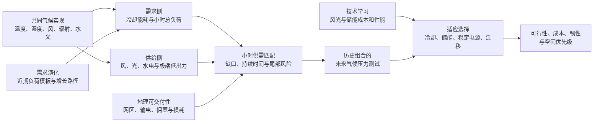

# 气候变化下全球数据中心 24/7 无碳电力的供需耦合风险与适应

**英文题目：** *Climate change reshapes the feasibility of 24/7 carbon-free electricity for global data centers*

## 方案摘要

数据中心正在从年度可再生能源采购转向逐小时、具有地理可交付性的 24/7 无碳电力（carbon-free energy, CFE）匹配，但现有规划通常依据历史天气设计供电组合，并把数据中心负荷视为不受气候影响的固定曲线。本研究拟建立全球数据中心设施、小时用电需求、气候驱动的无碳电力供给与电网可交付性之间的统一模型，检验未来气候如何同时改变需求侧冷却能耗和供给侧风、光及水电可用性。研究将利用最近三个数据质量完整年份构建去趋势、归一化的当前 IT 工作负荷模板，以单位 IT 负荷形成全球可比基准，并通过低、中、高需求增长路径外推未来算力规模。风电、光伏和储能的成本及性能则通过独立的技术学习情景演化，从而把气候效应、需求扩张和技术进步分开识别。通过“历史基线优化—未来气候压力测试—气候知情再优化”，本研究将量化小时未匹配电量、最差 24/168 小时缺口、不适应损失和气候韧性溢价，并比较冷却升级、储能、清洁稳定电源、可交付跨区采购与计算负荷迁移的适应价值。研究的目标不是预设全球风险普遍恶化，而是识别风险增强、风险抵消以及需求增长与技术学习改变适应选择的区域条件，为数据中心选址、小时绿电采购和气候稳健的 CFE 投资提供可验证依据。

> [!important] 一句话科学问题
> **气候变化如何共同重塑全球数据中心的小时用电需求与本地及跨区可交付的无碳电力供给，并由此改变其实现 24/7 CFE 的可行性、成本与适应路径？**

## 1. 研究背景与科学张力

24/7 CFE 要求数据中心在每一个用电小时，以同一可交付电网范围内的无碳电力覆盖负荷。它不同于年度购电协议或可再生能源证书的总量抵消：即使全年采购电量等于全年用电量，夜间、静风期和长时间低风光事件仍可能由化石电力填补。既有研究已经表明，小时匹配目标越接近 100%，所需储能、清洁稳定容量和系统成本越可能非线性上升；时间和空间上的计算负荷迁移可以降低部分匹配成本。1,2 然而，这些结论主要建立在历史天气或单一年份资源条件上，尚不足以说明按历史气候配置的采购组合能否适应未来气候。

气候变化对数据中心并非单向的“供给冲击”。温度、露点和湿度会缩小自然冷却窗口并抬升机械制冷用电，进而改变设施总负荷和峰值时刻。全球设施研究已经识别出热湿条件对空气自然冷却的限制，物理模型也表明 PUE 和 WUE 可随天气及冷却技术逐小时变化。3,4 与此同时，风速、太阳辐射、云量和水文过程会改变无碳电力的均值、季节性和极端低出力事件。全球与区域研究发现，气候变化可能削弱部分地区的风光供需匹配，而较小的年均资源变化也可能被放大为持续时间更长的极端电力短缺。5-9

现有研究在三条文献链上分别取得了进展，却仍缺少一个共同的分析单元。数据中心气候研究多聚焦冷却窗口，没有连接设施总负荷和小时 CFE 组合；气候—电力研究多采用国家或网格负荷，没有落到具体数据中心；24/7 CFE 优化研究则很少处理未来气候非平稳性。根据截至 2026 年 7 月 27 日的结构化检索，尚未识别到同时覆盖“具体设施、小时负荷、未来气候、可交付无碳供给和 24/7 CFE 优化”的研究。该判断是有检索边界的证据缺口，而不是对所有未收录文献的绝对否定，详见 证据矩阵。

本研究的核心科学张力在于：**气候变化可能增加冷却需求，却不一定同步降低太阳能供给；数据中心需求增长可能扩大物理缺口，而风光与储能的技术学习又可能降低填补缺口的成本；扩大采购半径可能利用资源互补，却也可能在广域同步低风光事件和输电受限时失效。** 因此，研究不能先验假设所有设施均恶化，也不能仅凭年均容量因子或单一成本趋势判断 24/7 CFE 的气候稳健性。气候、需求规模和技术进步是三个不同驱动因素，必须先通过控制变量识别气候净效应，再在联合情景中评估现实的未来适应路径。

## 2. 研究目标与分析主线

本研究拟完成五个相互衔接的目标。第一，利用最近三个数据质量完整年份构建可外推的当前 IT 工作负荷模板，并将温湿度驱动的冷却附加用电与同一气候实现下的风光供给连接起来。第二，量化未来气候对小时 CFE 缺口的净影响，并分解冷却需求变化、供给变化及二者交互项。第三，将低、中、高数据中心需求增长路径与风光、储能技术学习路径叠加到气候情景中，区分规模扩张、气候变化和技术进步的贡献。第四，将历史气候下的最优采购组合置于未来气候中运行，测量因规划惯性产生的不适应损失。第五，在统一的成本和可靠性框架中比较冷却升级、储能、清洁稳定电源、地理采购扩展和计算负荷迁移，识别不同市场与气候事件下的最优适应组合。

该框架遵循 气候影响路径 的双侧冲击逻辑，并以 24-7-CFE的地理边界与采购情景 的可交付性定义约束“本地”和“异地”无碳电力。电力跨区输送与计算任务迁移分别建模，前者改变可到达负荷节点的电力集合，后者改变数据中心之间的负荷分布，二者不作等价处理。

## 3. 可证伪假设

| 假设 | 预期机制 | 主要检验量 | 可推翻条件 |
|---|---|---|---|
| H1：未来气候对尾部缺口的影响大于对年均 CFE 覆盖的影响 | 极端热湿与持续低风光事件主要改变分布尾部 | 年均 CFE Score、最差 24 h/168 h 缺口、事件持续时间 | 多模型下年均变化系统性大于尾部变化，或尾部变化不稳健 |
| H2：需求和供给的共同变化具有非加性交互 | 同一天气系统同时塑造冷却负荷和可再生出力，优化约束进一步放大或抵消影响 | 四组反事实及交互项 | 联合效应在主要区域与单侧效应之和无可辨识差异 |
| H3：全球影响方向具有显著区域异质性 | 高温可能与高太阳辐射共现，而热湿、静风或多云条件可能强化缺口 | 市场类型、效应符号一致性、区域排序变化 | 绝大多数区域表现为方向一致且机制同质 |
| H4：历史最优组合在未来气候下产生可测量的不适应损失 | 历史容量与选址适应历史资源联合分布，而非未来尾部事件 | $J_F(x_H^*)-J_F(x_F^*)$、容量差异、成本差异 | 历史组合与未来再优化组合在多模型下近似等价 |
| H5：扩大可交付采购范围存在递减收益和事件条件 | 空间互补先降低本地缺口，广域同步干旱与输电拥塞随后限制收益 | S1–S5 边际收益、跨区相关性、拥塞小时 | 收益随采购范围近似线性增加且不受事件相关性影响 |
| H6：适应措施具有明显的区域分工 | 冷却升级作用于需求，储能作用于时间错配，稳定电源作用于长尾，迁移作用于空间错配 | 成本—风险前沿与技术组合 | 单一措施在所有区域和目标水平上均占优 |
| H7：需求增长与技术学习对未来 24/7 CFE 成本产生方向相反但非对称的影响 | 需求扩张增加绝对供给与灵活性需求，风光储学习降低单位适应成本，但不直接消除气候导致的小时物理缺口 | 全因子情景、单位与总成本、容量需求、Shapley 贡献 | 技术学习在各区域均完全抵消需求增长与气候风险，或两者贡献方向并不稳定 |

## 4. 研究范围与分析单元

### 4.1 空间范围

全球分析以设施点位和数据中心市场集群为基本空间单元。候选设施表包括 Data Center Watch 的 27,525 条记录、PeeringDB 的 5,860 条记录、IM3 的美国建筑和园区边界、中国数据集的 1,005 个点以及 Epoch AI 的 75 个高算力项目。上述数字表示尚未完全去重的来源记录，不等于全球真实设施总数，也不代表容量分布。设施将通过名称、运营商、地址、空间距离和园区关系进行实体解析，并保留来源、坐标精度、运行状态、容量信息、许可和重复簇。

全球可比分析把最近三年得到的归一化 IT 工作负荷模板缩放到 **1 MW 平均 IT 负荷**，以避免容量缺失把点位数量误写为真实用电规模；恒定 1 MW 负荷作为隔离冷却效应的机制基线。第二层结果使用有 MW、机架或建筑面积信息的子样本进行容量加权。第三层通过区域装机、机架数和建筑面积建立低、中、高需求规模与增长路径，用于评估绝对电量、投资和成本的未来变化。全球结果按设施和市场集群分别汇总，以降低同一园区多条目录记录造成的伪重复。

### 4.2 时间与气候范围

历史参考期以 1995–2014 年为主，以便与 CMIP6 历史基准衔接；1980–2024 年 ERA5 全时段用于估计年际变率和历史极端事件。近期 IT 需求模板使用数据获取时最近三个质量完整的自然年，原则上优先采用 2023–2025 年，但其年份随数据可得性更新。未来设置 2031–2050 年和 2051–2070 年两个气候时间片，并比较 SSP1-2.6、SSP2-4.5 和 SSP5-8.5。需求模板的参考年份不限制未来需求规模，其日内与周内形状通过增长系数和结构变化情景外推。所有核心结论均基于多气候模式集合，不将单一模式或单一典型年视为确定性未来。

### 4.3 CFE 技术与采购边界

CFE 技术集合包含风电、光伏、符合情景边界的水电、核电、地热、短时与长时储能。若第一阶段模型只实现风、光和储能，结果将明确称为“面向 24/7 CFE 的风光储匹配”，不把风光等同于全部 CFE。研究保留 原设计的五种地理匹配情境，使采购范围从设施场内逐步扩展到跨区电网，并以无地理约束证书作为宽松会计对照。

#### S1–S5 五种地理匹配情境

| 情境 | 允许计入的供给 | 是否属于严格 24/7 CFE | 必须实施的约束 | 在本研究中的实验角色 |
|---|---|---|---|---|
| **S1 场内供电** | 屋顶光伏、园区风光、场内清洁稳定电源与场内储能 | 是 | 设施或园区土地、当地资源、设备容量、储能能量守恒和小时供需平衡 | 测量完全本地化供电的可行性、土地约束和储能需求，作为最窄供给边界 |
| **S2 本地直供** | 邻近风光或其他 CFE 项目，通过专线、private wire 或可核验的直接供电关系连接设施 | 是 | 专线容量、线路损耗、小时计量、属性唯一性，以及设施与项目面临的共同天气暴露 | 检验扩大到邻近项目后能否降低场内土地和储能压力，以及本地共同气候风险是否限制收益 |
| **S3 同网区异地采购** | 同一 balancing authority、ISO、bidding zone、省级电网或其他合规网区内的 PPA、CFE 发电和储能 | 通常是；本研究的严格主情境 | 同小时匹配、同网区归属、发电属性追踪、储能来源追踪和防止重复计算 | 代表目前最具现实性的 24/7 CFE 采购范围，承担跨区域和跨气候情景的主结果 |
| **S4 跨区可交付采购** | 相邻或互联电网区域内的 CFE，通过实际电网向负荷区域交付 | 有条件属于 | 每小时剩余输电容量、潮流方向、线路损耗、拥塞、边界规则与属性转移 | 量化跨区资源互补及输电扩展的气候适应价值，并识别广域同步低风光事件下的失效条件 |
| **S5 无地理约束证书** | 任意地区的 REC、EAC、GO 或年度绿电采购，不要求与负荷处于可交付电网范围 | 否 | 仅要求会计属性和避免证书重复使用，不施加物理可交付约束 | 作为宽松核算和理论上限，对比其对小时覆盖的高估程度；不得作为严格 24/7 CFE 成果 |

S1–S4 形成逐步扩大的合格供给集合，但它们并不保证效果单调增加：S2 可能因共同天气暴露而缺少空间互补，S4 也可能因输电拥塞和广域同步风光干旱而无法使用名义上的异地资源。S5 不进入严格 24/7 CFE 的主结论，只回答“忽略物理可交付性会高估多少小时无碳覆盖和低估多少适应成本”。

五个情境采用嵌套式实验设计。首先在相同气候实现、技术成本、CFE 目标和 IT 负荷下分别优化 S1–S5，以识别扩大地理边界的边际价值；随后冻结各自的历史最优组合并进行未来气候压力测试；最后在未来气候中重新优化，比较不同采购范围下的不适应损失和气候韧性溢价。主结果使用 S3，S1、S2 与 S4 用于解释空间范围和可交付性的作用，S5 提供宽松会计反事实。

## 5. 数据体系

| 数据层 | 首选数据 | 关键变量 | 在研究中的作用 |
|---|---|---|---|
| 设施 | Data Center Watch、PeeringDB、IM3、中国数据集、Epoch AI | 坐标、地址、运营商、状态、容量代理、园区边界 | 设施实体解析、气候暴露和市场聚类 |
| 近期需求 | 最近三个数据质量完整年份的设施或市场小时负荷、可获得的 IT 遥测与 PUE、公开计算工作负荷轨迹 | 总用电、IT 负荷、PUE、小时与星期、业务趋势、可迁移任务比例 | 构建去趋势、归一化的当前工作负荷模板并校准冷却响应 |
| 历史天气 | ERA5 | 2 m 温度、露点、相对湿度、短波辐射、100 m 风速 | 小时负荷与风光出力基线、极端事件识别 |
| 未来气候 | CMIP6、HighResMIP | 温湿度、风、辐射及必要的水文变量 | 多模式、多情景未来压力测试 |
| 电网与资源 | PyPSA-Earth、PyPSA-Eur、开放电网边界和资源潜力 | 节点、线路、网区、容量、输电上限、技术成本 | 可交付性矩阵和容量扩张 |
| 小时验证 | ENTSO-E、EIA及可获得的市场运营商数据 | 负荷、风光发电、跨区交换 | 供给模型和电网聚合验证 |
| 现实 CFE 基准 | 公开区域 CFE 数据与企业披露 | 区域小时 CFE 指标、PUE 范围 | 数量级与区域排序检查 |
| 技术学习 | 同行评审学习率、权威成本投影与技术性能情景 | 累计装机、资本成本、效率、寿命、学习率 | 外推风电、光伏、短时与长时储能的未来成本和性能 |

数据治理遵循 数据清单 的许可原则。每条设施记录保留 `source`、`license`、`retrieved_at`、`redistribution_allowed` 和坐标精度字段。商业目录只用于许可范围内的内部分析；公开成果提供来源说明、可复现代码、聚合结果及允许再分发的数据，不重新发布受限原始目录。

## 6. 方法设计

### 6.1 设施实体解析与电网映射

设施清洗首先统一名称、地址和坐标参考系，再以规则匹配和概率匹配结合的方式识别重复设施与园区。距离很近但运营商或地址不同的记录不会仅因空间邻近而强制合并。每个实体获得 `facility_id`、`campus_id` 和 `market_id` 三层标识，并记录坐标来自楼宇、街道、城市中心点还是推断位置。主结果剔除仅有国家级位置的记录，城市中心点记录进入全球覆盖分析但在精细暴露分析中单独标记。

设施随后映射到电网分区。北美优先使用 balancing authority 或 ISO/RTO，欧洲使用 bidding zone，中国使用省级电网；缺少细分边界的国家暂以国家或互联大区为代理。对设施 $i$ 与发电区域 $j$，定义小时可交付性矩阵 $A_{ij,t}$。只有同网区供给或在该小时具备剩余输电能力的跨区供给才能计入合格 CFE：

$$
E^{\mathrm{eligible}}_{i,t}=\sum_j A_{ij,t}E^{\mathrm{CFE}}_{j,t}.
$$

其中，$E^{\mathrm{eligible}}_{i,t}$ 是设施 $i$ 在小时 $t$ 可核算的无碳电量，$E^{\mathrm{CFE}}_{j,t}$ 是区域 $j$ 的可分配无碳发电，$A_{ij,t}$ 同时反映采购边界、输电容量、损耗和拥塞。不同 S1–S5 情景通过改变 $A_{ij,t}$ 的允许连接和约束实现。

### 6.2 气候情景构建与联合降尺度

历史模型直接使用 ERA5 小时序列。未来气候若只有三小时或日尺度，将采用多变量 quantile-delta mapping 或 weather morphing，把气候模式给出的分布变化施加到历史小时序列。降尺度将联合处理温度、湿度、风速和辐射，尽可能保留热浪、云系、静风和水文干旱之间的相关结构，而不是分别随机重采样各变量。HighResMIP 用于检验更高时间分辨率是否改变复合事件持续时间和区域排序。

同一个经偏差校正的气候实现同时驱动数据中心负荷和无碳供给。该设计是识别交互效应的必要条件；若需求和供给分别从不相关天气年抽取，将破坏真实的同步或抵消关系，并可能错误估计储能和跨区多样化价值。

### 6.3 小时数据中心负荷模型

需求模型将“计算服务需求”和“气候敏感的设施附加用电”分开。相同的 IT 工作负荷在不同天气下并不对应相同的设施总用电，因为冷却、风机、水泵和部分配电损耗会随温湿度变化。设施总负荷由 IT 负荷与气候敏感的 PUE 共同决定：

$$
L_{i,t,z}=P^{\mathrm{IT}}_{i,t,z}\times PUE(T_{i,t,z},RH_{i,t,z},T^{\mathrm{dew}}_{i,t,z},k_i),
$$

其中，$L_{i,t,z}$ 为设施 $i$ 在小时 $t$ 和情景 $z$ 下的总用电，$P^{\mathrm{IT}}_{i,t,z}$ 为完成计算任务所需的 IT 负荷，$T_{i,t,z}$、$RH_{i,t,z}$ 和 $T^{\mathrm{dew}}_{i,t,z}$ 分别为温度、相对湿度和露点，$k_i$ 表示冷却技术原型。PUE 模型将参考已有物理模型和空气自然冷却阈值研究进行参数化。3,4 冷却原型至少包括空气自然冷却、间接蒸发冷却、冷水机和液冷。设施技术未知时，不作单点伪精确赋值，而采用区域先验与蒙特卡洛抽…1626 tokens truncated…D_F,S_F)$。以某一结果量 $Y$ 为例，需求效应、供给效应和交互项分别为：

$$
\Delta_D=Y(D_F,S_H)-Y(D_H,S_H),
$$

$$
\Delta_S=Y(D_H,S_F)-Y(D_H,S_H),
$$

$$
\Delta_{DS}=Y(D_F,S_F)-Y(D_H,S_H)-\Delta_D-\Delta_S.
$$

$\Delta_{DS}$ 不被简单解释为纯气象相关性；它还可能包含储能、输电和容量约束产生的优化非线性。上述四组反事实固定需求增长和技术参数，因此专门识别气候通过冷却需求与发电资源产生的双侧效应。通过“固定运行组合”和“允许重新优化”两套分解，可进一步区分物理交互与决策交互。

现实未来还受到需求扩张和技术学习影响。研究将气候状态记为 $C\in\{C_0,C_1\}$，需求规模与结构记为 $G\in\{G_0,G_1\}$，技术成本与性能记为 $T\in\{T_0,T_1\}$，在代表性市场运行 $2^3=8$ 组全因子情景。结果量写为 $Y(C,G,T)$，并采用 Shapley 分解或等价的顺序平均分解气候变化、需求增长和技术学习的边际贡献，避免效应取决于人为规定的加入顺序。主文首先报告控制 $G$ 和 $T$ 后的气候净效应，再报告三类驱动共同作用下的现实未来路径。

### 6.7 复合事件与尾部风险

系统风险不只由年均 CFE Score 衡量。研究同时报告全年未匹配电量、缺口小时数、最差连续 24 小时与 168 小时缺口，以及短缺事件的频率、持续时间和强度。复合事件采用物理阈值与系统阈值并行识别：物理阈值要求冷却负荷异常偏高且合格 CFE 供给异常偏低；系统阈值要求 $u_{i,t}$ 连续超过给定比例，或缺口持续时间超过既有储能的覆盖能力。

阈值将覆盖未匹配比例 10%、30% 和 50%，持续时间覆盖 12、24、100 和 168 小时。该多阈值设计吸收可再生能源干旱研究的经验，避免单一阈值决定结论。8,9 事件分析还将识别“高温—高太阳能”的抵消型事件，以检验并约束“高温必然恶化 24/7 CFE”的过度概括。

### 6.8 适应组合比较

适应情景分为需求侧、时间侧、供给侧和空间侧。需求侧包括冷却技术升级、提高冷冻水温度设定值和液冷渗透；时间侧包括短时电池、长时储能和可延迟计算；供给侧包括扩大风光组合、清洁稳定电源和受约束水电；空间侧包括同网区采购扩展、跨区可交付采购和计算负荷迁移。组合情景允许这些措施共同选择，以构建“成本—年均覆盖—尾部风险”三维前沿。

空间策略的比较重点是区分两种机制。扩大电力采购通过 $A_{ij,t}$ 和输电约束改变可用电力；计算迁移通过工作负荷守恒改变 $P^{\mathrm{IT}}_{i,t}$。研究将估计每增加一个可迁移负荷百分点和每增加一个跨区输电单位所减少的未匹配电量及成本，并检验该边际价值如何随跨区气候相关性变化。

## 7. 情景矩阵

| 维度 | 主设置 | 敏感性设置 |
|---|---|---|
| 气候 | 1995–2014；2031–2050 与 2051–2070 的 SSP2-4.5 | SSP1-2.6、SSP5-8.5；HighResMIP |
| 天气年取样 | 每个 20 年窗口选取 5 个完整代表年联合优化，并在全部 20 年压力测试 | 30–40 年历史长序列用于 100% CFE 尾部可靠性检验 |
| 当前需求 | 最近三个完整年份构建的去趋势、归一化 IT 工作负荷模板，缩放为 1 MW 平均 IT 负荷 | 恒定 1 MW 机制基线；逐个近期年份而非中位模板 |
| 未来需求 | 中等需求增长路径与当前工作负荷形状 | 低/高增长；AI 训练、推理与传统云业务结构变化 |
| 采购地理 | **S1 场内供电、S2 本地直供、S3 同网区异地采购、S4 跨区可交付采购、S5 无地理约束证书**；以 S3 为主结果 | 比较 S1→S4 的边际空间收益，并以 S5 量化忽略可交付性的偏差 |
| CFE 目标 | 95% 与 100% | 90%、99% |
| 技术集合 | 风、光、储能、清洁稳定电源 | 水文敏感水电、不同储能时长与技术成本 |
| 技术学习 | 风电、光伏、短时和长时储能的中等学习路径 | 无学习、低学习和高学习；性能改善与成本下降分开设置 |
| 适应 | 无适应、单项适应、组合适应 | 不同负荷迁移比例和输电扩展上限 |
| 规划认知 | 历史优化后未来压力测试 | 完美预见、鲁棒优化、分阶段投资 |

主结果不会穷举所有情景组合，而以 SSP2-4.5、S3、95%/100% CFE、最近三年需求模板和中等技术学习路径形成清晰故事线。气候净效应使用 1 MW 当前需求规模和固定技术参数作为控制实验；现实未来使用需求增长与技术学习的联合情景。其余设置用于检验结论是否依赖特定排放路径、采购边界、需求外推或学习率假设，完整情景结果进入补充材料和交互式数据产品。

## 8. 结果指标与统计分析

核心结果首先使用读者可直接理解的物理量表达，包括未被同步无碳电力覆盖的 MWh、缺口小时数、最差一天和最差一周的缺口、为 1 MW IT 负荷增加的储能 MWh，以及适应投资的年化成本。单位 IT 负荷结果用于比较气候暴露，需求增长情景下的绝对 MWh、MW 和成本用于表达未来系统规模；两类结果不相互替代。正式指标包括负荷加权 CFE Score、unmatched energy、事件频率—持续时间—强度、储能 MW/MWh、清洁稳定容量、climate resilience premium、maladaptation loss 和设施/市场脆弱性排序，定义详见 指标与模型。

气候模式是未来不确定性的主要统计单元。每个区域报告多模式中位数、四分位距、5%–95% 范围和效应符号一致性，不把数万个相邻设施视为数万个独立气候样本。空间不确定性通过网格或市场聚类 bootstrap 估计，设施重复簇在重采样时作为整体处理。区域比较优先报告效应大小、排序稳定性和机制类型，显著性检验只作为补充。

不确定性传播至少覆盖七类因素：气候模式与排放情景、近期工作负荷模板、未来需求增长、冷却技术原型、设施容量代理、网区边界与可交付性，以及技术学习率与性能。采用分层 Monte Carlo 或拉丁超立方抽样构建联合参数样本，并用方差分解或全局敏感性分析识别主导不确定性。若全球全组合优化计算量过高，先用代表性市场估计需求增长和技术学习的敏感性，再把筛选后的关键参数传播到全球单位负荷模型。

## 9. 验证、稳健性与可重复性

供给侧将以 ENTSO-E、EIA 和可获得的市场小时发电序列验证风光容量因子的季节性、日内变化和低出力持续时间。需求侧首先对最近三个年份逐年留一验证工作负荷模板，检验其对未参与建模年份的日内曲线、峰值时刻和小时负荷分布的再现能力；随后把模型 PUE 的气候响应与公开设施 PUE 范围、冷却技术工程参数及现有逐小时 PUE/WUE 模型比较。若只获得总表计负荷，将同步检验 IT—冷却分离对不同冷却原型的敏感性。由于公开设施级小时总负荷稀缺，验证将明确区分“工作负荷形状验证”“冷却物理过程验证”“区域数量级验证”和“真实设施外部验证”，不把企业年度平均 PUE 当作小时模型的充分验证。

稳健性检验包括替换历史基准期、替换气候降尺度方法、排除城市中心点坐标、改变设施去重半径、采用设施等权与容量加权、改变网区边界、设置不同 CFE 技术集合，以及比较固定阈值和多阈值事件定义。对最脆弱和最具代表性的市场，将人工核查设施坐标、网区映射和极端周天气过程，形成案例级审计链。

所有模型输入、清洗规则、参数版本、随机种子和求解器设置写入机器可读配置。代码按“原始数据登记—标准化—气候提取—需求模型—供给模型—优化—统计—制图”分层组织，并为每一张主图保存可重建的分析表。数据许可不允许公开时，提供字段字典、哈希、聚合输出和从合法来源重新获取数据的脚本。

## 10. 预期结果及判别逻辑

本方案不预填尚未计算的结果数值，但预期形成五类可被数据推翻的结果。第一，未来年均 CFE 覆盖的变化可能小于最差日、最差周和长持续短缺事件的变化；若多模式结果相反，论文主张应转向均值资源变化。第二，部分热湿地区可能出现冷却负荷上升与低风或水文约束同步的风险增强，而高太阳资源地区可能表现为冷却需求增长被白天光伏部分抵消。第三，历史组合在未来气候中的损失预计集中于少数尾部小时，因此新增稳定容量和长时储能的价值可能高于其在年均指标中的表观价值。第四，扩大采购地理范围预计先受益于资源互补，随后受到广域同步事件与输电限制；若未观察到递减收益，应重新评估网区边界和输电建模是否过于宽松。第五，需求增长预计放大绝对容量和缺口，而技术学习主要降低适应成本并改变最优技术组合；如果学习带来的成本下降完全抵消规模增长和气候风险，则应相应收缩“气候提高实现成本”的结论。

研究最终将按“需求增强型风险、供给衰减型风险、复合放大型风险、太阳能抵消型风险和空间多样化受限型风险”对数据中心市场进行分类。这一分类不是额外发明一个难以解释的综合指数，而是依据冷却负荷变化、合格 CFE 变化、尾部缺口变化和空间相关性的可读物理量形成。每一种类型都对应明确的适应优先级，从而把全球风险地图转化为可操作的规划选择。

## 11. 预期创新与学术贡献

本研究的第一项创新是以最近三个完整年份的需求数据构建可外推的 IT 工作负荷模板，再把全球设施级数据中心负荷作为气候敏感对象，而非固定负荷点。已有冷却研究提供温湿度阈值和 PUE 建模基础，本研究进一步把相同计算需求在不同天气下的冷却变化转换为设施总用电，并进入小时无碳匹配。

第二项创新是在同一气候实现中耦合需求侧与供给侧，既保留热湿、风、云和辐射的相关性，也允许抵消效应出现。该设计能够区分单侧暴露、物理交互和优化非线性，避免把独立天气序列拼接后得到的假同步解释为复合风险。

第三项创新是提出“历史组合—未来运行—未来再优化”的气候稳健性检验，并用全因子情景区分气候变化、需求增长和技术学习。它把气候影响从资源变化转化为规划损失、额外储能、稳定容量和年化成本，同时避免把未来算力扩张或技术降本误归因于气候。

第四项创新是把 24/7 CFE 的地理边界作为待检验的系统条件。研究不把任意异地证书视为小时无碳供电，而以可交付矩阵区分场内、本地、同网区和跨区采购，并进一步与计算负荷迁移比较。这使“扩大地理范围是否提高气候韧性”成为可以量化而非概念性的命题。

## 12. 预期图件与论文叙事

| 图件 | 科学对象 | 计划面板与核心比较 |
|---|---|---|
| 图 1 | 全球数据中心的双侧气候暴露 | 设施与网区地图；需求侧与供给侧路径；历史暴露类型 |
| 图 2 | 气候变化重塑小时缺口的尾部 | 年均 CFE 变化；最差 24 h/168 h；区域异质性与模式一致性 |
| 图 3 | 需求、供给与交互项 | 四组气候反事实；气候、需求增长和技术学习的全因子分解 |
| 图 4 | 复合短缺事件 | 代表性最差周；频率、持续时间、强度；跨区同步性 |
| 图 5 | 历史组合的未来气候压力测试 | $x_H^*$ 与 $x_F^*$；不适应损失；新增容量和成本 |
| 图 6 | 适应组合与空间边界 | 成本—风险前沿；S1–S5；技术学习；电力跨区与计算迁移的边际价值 |

论文结果章节按 文章大纲 的五步故事展开：先证明双侧暴露存在，再说明尾部比均值更重要，随后分解交互机制，量化历史组合的不适应损失，最后比较适应措施。每个结果小节围绕一张主图形成完整论点，图题描述数据和编码，机制解释保留在正文中。

## 13. 工作计划与阶段成果

| 阶段 | 月份 | 主要任务 | 可交付成果与门槛 |
|---|---:|---|---|
| I. 数据底座 | 1–3 | 设施实体解析、近期三年需求整理、许可登记、坐标精度与网区映射 | 可审计设施表；去趋势需求数据；重点市场抽检准确率达到预设门槛 |
| II. 双侧物理模型 | 4–6 | 当前工作负荷模板、PUE/负荷原型、风光出力、历史极端事件验证 | 历史单位负荷数据库；需求与供给验证报告 |
| III. 历史 24/7 CFE 基线 | 7–9 | S1–S5 核算、容量扩张和调度、代表市场筛查 | 历史基线结果；最小可发表版本的图 1–3 |
| IV. 未来气候与压力测试 | 10–12 | 多模式降尺度、四组反事实、历史组合冻结运行 | 气候效应分解；不适应损失与复合事件结果 |
| V. 适应与稳健性 | 13–15 | 需求增长、技术学习、冷却、储能、稳定电源、输电和计算迁移比较 | 适应前沿；三类驱动分解；不确定性与敏感性分析 |
| VI. 论文与开放成果 | 16–18 | 主图、正文、补充材料、代码和数据说明 | 可投稿稿件；可复现仓库；设施市场风险数据产品 |

若计算或数据获取限制阻碍全球容量扩张模型，最小可发表版本将聚焦 20–30 个主要数据中心市场，以最近三年归一化需求模板和 1 MW 恒定负荷基线运行完整的多气候模式与适应对照；全球所有设施只执行暴露和简化匹配计算。需求增长与技术学习的全因子分解优先在代表性市场完成，再用筛选后的情景扩展到全球。该缩减保留“需求—供给共同变化、未来压力测试和气候知情再优化”三项核心贡献，而不以点位数量替代模型深度。

## 14. 可行性、风险与备选路径

> [!warning] 关键风险一：设施容量和坐标并不完整
> 以单位 IT 负荷作为主分析对象；容量加权限于有证据的子样本；坐标精度分层报告并对城市中心点作排除检验。结论首先解释位置和气候敏感性，不直接宣称全球数据中心总用电。

> [!warning] 关键风险二：未来小时气候序列与复合极端存在降尺度误差
> 使用多变量方法保留联合结构，以 HighResMIP 和不同降尺度方法进行敏感性检验；结论以模式集合、符号一致性和事件范围表达，不提供虚假的单点预测。

> [!warning] 关键风险三：全球电网边界和输电可用容量不一致
> 全球层面以标准化网区代理完成可比分析，重点市场采用精细网络复核；同时报告 S1–S5，量化边界假设对结果的影响。

> [!warning] 关键风险四：PUE 模型难以获得设施级小时实测验证
> 使用多个冷却原型和工程参数区间传播不确定性，优先验证气候响应的方向、斜率和阈值，不把年度企业 PUE 当作设施级小时真值。

> [!warning] 关键风险五：近期小时需求和未来增长路径存在数据缺口
> 最近三年只有总表计负荷时，先用同期天气与 PUE 模型分离 IT 和冷却负荷；无法可靠分离的市场采用标准化工作负荷原型，并单独标记证据等级。未来需求不使用单一确定预测，而以低、中、高增长和工作负荷结构情景表达；技术学习同样使用无学习、低、中、高路径，避免用单一学习率决定成本结论。

> [!note] 证据边界
> Qiu 等关于气候知情可再生能源选址和资源充裕度的 2026 年研究目前在知识库中仅以出版商元数据和摘要核验，正式写稿引用具体方法或数值前需要取得并复核全文。Data Center Map 的 9,447 个设施来自已发表研究，只用于文献对照，不从论文或商业目录反向重建并公开其点位。

## 15. 预期成果与投稿路径

核心成果是一篇原创研究论文、一套可复现的全球数据中心气候—CFE 分析流程、一个按许可公开的设施市场风险数据产品，以及面向规划者的交互式地图或静态图集。若完成全球设施、多模式小时气候、可交付电网约束和适应优化，可优先尝试 *Nature Energy*、*Nature Communications* 或 *Joule*；若首先完成 20–30 个代表市场，则以 *Applied Energy* 或 *Advances in Applied Energy* 为更匹配的投稿路径。

论文的主要科学贡献应落在“气候非平稳性如何改变 24/7 CFE 规划”上，而不是将数据中心 POI 数量本身作为贡献。政策含义将分别面向两类主体：对数据中心运营商，提出气候知情选址、采购、冷却和灵活计算组合；对标准制定者与电力系统规划者，提出小时证书地理边界、气候压力测试和可交付性披露要求。

## 16. 参考文献

1. Riepin, I. & Brown, T. On the means, costs, and system-level impacts of 24/7 carbon-free energy procurement. *Energy Strategy Reviews* **54**, 101488 (2024). [https://doi.org/10.1016/j.esr.2024.101488](https://doi.org/10.1016/j.esr.2024.101488)
2. Riepin, I., Brown, T. & Zavala, V. M. Spatio-temporal load shifting for truly clean computing. *Advances in Applied Energy* **17**, 100202 (2025). [https://doi.org/10.1016/j.adapen.2024.100202](https://doi.org/10.1016/j.adapen.2024.100202)
3. Karamperidou, C. *et al.* Limitations to air free cooling in data centers under rising heat and humidity. *Scientific Reports* **16** (2026). [https://doi.org/10.1038/s41598-026-56926-3](https://doi.org/10.1038/s41598-026-56926-3)
4. Lei, N. & Masanet, E. Climate- and technology-specific PUE and WUE predictions for data centers. *Research Square* preprint (2021). [https://doi.org/10.21203/rs.3.rs-769999/v1](https://doi.org/10.21203/rs.3.rs-769999/v1)
5. Liu, L. *et al.* Climate change impacts on planned supply–demand match in global wind and solar energy systems. *Nature Energy* **8** (2023). [https://doi.org/10.1038/s41560-023-01304-w](https://doi.org/10.1038/s41560-023-01304-w)
6. Zheng, D. *et al.* Climate change impacts on the extreme power shortage events of wind-solar supply systems worldwide during 1980–2022. *Nature Communications* **15** (2024). [https://doi.org/10.1038/s41467-024-48966-y](https://doi.org/10.1038/s41467-024-48966-y)
7. Qiu, L. *et al.* Climate change reshapes resource adequacy risks and optimal renewable energy siting in wind and solar energy systems. *Nature Energy* (2026). [https://doi.org/10.1038/s41560-026-02109-3](https://doi.org/10.1038/s41560-026-02109-3)
8. Li, B. *et al.* Renewable energy quality trilemma and coincident wind and solar droughts. *Communications Earth & Environment* **5** (2024). [https://doi.org/10.1038/s43247-024-01850-5](https://doi.org/10.1038/s43247-024-01850-5)
9. Kittel, M. & Schill, W.-P. Multi-threshold time series analysis enables characterization of variable renewable energy droughts in Europe. *Communications Earth & Environment* (2026). [https://doi.org/10.1038/s43247-026-03251-2](https://doi.org/10.1038/s43247-026-03251-2)

## 17. 知识库连接

研究问题与创新：研究定位与创新；概念边界：24-7-CFE、气候影响路径、24-7-CFE的地理边界与采购情景；方法与指标：方法设计、指标与模型；数据：数据清单；文献证据：证据矩阵；论文结构：文章大纲。
